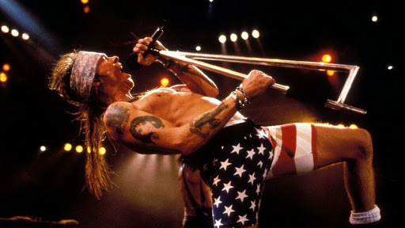
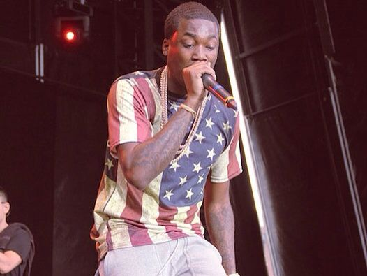

Like artists in most fields, songwriters often use their platforms to express political views. In this analysis, I evaluate sentiment within song lyrics to answer several related questions:

-What types of patriotic and political words do songwriters feel positively or negatively about?

-Do different genres express different political views?

-Which genres are most likely to get political?

```{r setup, include=FALSE}
knitr::opts_chunk$set(echo = TRUE)
```

```{r load libraries, include=FALSE}
library(tidyverse)
library(tidytext)
library(ggplot2)
theme_set(theme_light())
```

```{r data processing, include=FALSE}
# Load lyrics data
load('../output/processed_lyrics.RData')

#Remove duplicate songs (same lyrics or same title/artist combination)
dt_lyrics <- dt_lyrics %>%
  distinct(stemmedwords, .keep_all = TRUE) %>%
  distinct(song, artist, .keep_all = TRUE)

#Use the AFINN sentiment lexicon
sentiment <- get_sentiments('afinn')

#Words to analyze
relevant_words <- c('america','american','usa','president','republican','democratic','reagan','bush','clinton','obama')

#Analyze the 5 words before and after each relevant word
n <- 5

#Create a data frame where each word and its sentiment is a row
lyrics_sentiment <- dt_lyrics %>%
  unnest_tokens(word, stemmedwords) %>%
  left_join(sentiment, by='word') %>%
  rename(word_sentiment=value) %>%
  group_by(id)

#To each row, add a column for the sentiment of each of the 5 words before and after
for (i in 1:n) {
  col_name = paste("sentiment_lag", i, sep = "_")
  lyrics_sentiment <- lyrics_sentiment %>%
    mutate(!!col_name := lag(word_sentiment, i))
}
for (i in 1:n) {
  col_name = paste("sentiment_lead", i, sep = "_")
  lyrics_sentiment <- lyrics_sentiment %>%
    mutate(!!col_name := lead(word_sentiment, i))
}

#Filter for the relevant words, count the total nearby sentiment, and average within each song
lyrics_sentiment <- lyrics_sentiment %>%
  ungroup(id) %>%
  filter(word %in% relevant_words) %>%
  replace(is.na(.), 0) %>%
  mutate(nearby_sentiment=rowSums(select(., starts_with("sentiment_")))) %>%
  group_by(id, song, artist, genre, word) %>%
  summarise(nearby_sentiment=mean(nearby_sentiment))
```

## Notes on Data and Methodology
To answer these questions, I used the processed song lyric data based on the Text_Processing.Rmd starter code, with one notable modification: I did not remove any stop words. I made this decision for two reasons: (1) many of the stop words do, in fact, express a sentiment that I did not want to ignore, and (2) removing words from the lyrics would alter the distance between words, which plays a role in the analysis.

To measure sentiment, I used the AFINN lexicon (Finn Årup Nielsen), which scores each word on a scale from -5 (very negative) to +5 (very positive).

For each word, I measured its “nearby sentiment” by totaling the sentiment from the five words before and five words after it in the lyrics. For example, the song “No More” by Eddie Vedder includes the lines “No more evangelizing / No more presidents lying / No more war / With our minds”. The nearby sentiment around the word “presidents” is based on the sentiment of the five words before and after it:

-No (-1)

-More (0)

-Evangelizing (0)

-No (-1)

-More (0)

-Lying (0)

-No (-1)

-More (0)

-War (-2)

-With (0)

Therefore, the nearby sentiment for this mention of “presidents” is -5.

## Sentiment Around Patriotic Words

How do songwriters feel about the United States itself? According to the following chart, the nearby sentiment around the words “America”, “American”, and “USA” are positive on average. In other words, when song lyrics mention the name of the country, the surrounding words tend to be positive.

```{r, echo=FALSE}
#Create a bar chart for the average nearby sentiment of each patriotic word
lyrics_sentiment %>%
  filter(word %in% c('america','american','usa')) %>%
  group_by(word) %>%
  summarise(avg_sentiment=mean(nearby_sentiment)) %>%
  ggplot() +
  geom_bar(aes(x=word, y=avg_sentiment), stat='identity', fill='royalblue') +
  labs(title="Nearby Sentiment for Patriotic Words",
       x="", y="Average Nearby Sentiment") +
  theme(plot.title=element_text(hjust=0.5, size=16, face='bold'))
```

This patriotic sentiment, however, is not constant across genres. When considering nearby sentiment around those three patriotic words (“America”, “American”, and “USA”), the analysis finds that country, pop, and jazz music tend to be the most patriotic, while electronic and indie music have the most negative sentiment.

```{r, echo=FALSE}
#Create a bar chart for the average nearby sentiment of patriotic words, broken out by genre
lyrics_sentiment %>%
  filter((word %in% c('america','american','usa'))&!(genre %in% c('Other','Not Available'))) %>%
  group_by(genre) %>%
  summarise(avg_sentiment=mean(nearby_sentiment)) %>%
  ggplot() +
  geom_bar(aes(x=reorder(genre, desc(avg_sentiment)), y=avg_sentiment), stat='identity', fill='royalblue') +
  labs(title="Patriotic Sentiment by Genre",
       x="", y="Average Nearby Sentiment") +
  theme(plot.title=element_text(hjust=0.5, size=16, face='bold'))
```

## Sentiment Around Political Words

While songwriters seem to have positive things to say, on average, about the United States, they are more critical once topics become political. To measure political sentiment, I analyzed mentions of the major political parties (“Republican” and “Democratic”), the “President”, and the surnames of recent presidents (“Reagan”, “Bush”, “Clinton”, and “Obama”). As per the following chart, nearby sentiment around these political words tends to be negative (despite some small positive sentiment around “Democratic” and “Obama”).

(The analysis is, however, limited by the fact that the algorithm does not capture the true meaning of each mention. For example, it considers all mentions of the word “Bush” despite the inability to distinguish between references to George H.W. Bush, George W. Bush, and plants.)

```{r, echo=FALSE}
#Create a bar chart for the average nearby sentiment of each political word
lyrics_sentiment %>%
  filter(word %in% c('republican','democratic','president','reagan','bush','clinton','obama')) %>%
  group_by(word) %>%
  summarise(avg_sentiment=mean(nearby_sentiment)) %>%
  mutate(word=factor(word, levels=c('republican','democratic','president','reagan','bush','clinton','obama'))) %>%
  ggplot() +
  geom_bar(aes(x=word, y=avg_sentiment), stat='identity', fill='royalblue') +
  labs(title="Nearby Sentiment for Political Words",
       x="", y="Average Nearby Sentiment") +
  theme(plot.title=element_text(hjust=0.5, size=16, face='bold'))
```

When looking at the differences across genres in nearby sentiment for political words, the pattern is similar to what we saw when analyzing the patriotic words. Though average sentiment is more negative overall, pop, jazz, and country music still speak most highly of these political topics, while electronic and indie are once again the most critical.

```{r, echo=FALSE}
#Create a bar chart for the average nearby sentiment of political words, broken out by genre
lyrics_sentiment %>%
  filter((word %in% c('republican','democratic','president','reagan','bush','clinton','obama'))&!(genre %in% c('Other','Not Available'))) %>%
  group_by(genre) %>%
  summarise(avg_sentiment=mean(nearby_sentiment)) %>%
  ggplot() +
  geom_bar(aes(x=reorder(genre, desc(avg_sentiment)), y=avg_sentiment), stat='identity', fill='royalblue') +
  labs(title="Political Sentiment by Genre",
       x="", y="Average Nearby Sentiment") +
  theme(plot.title=element_text(hjust=0.5, size=16, face='bold'))
```

## Frequency of Patriotic and Political Topics

Finally, I explored the question of which genres are most likely to cover patriotic and political topics. Using the same word lists discussed above, the following chart shows the percentage of songs in each genre that have at least one mention of a patriotic or political word. Hip hop clearly appears to be the most likely to cover these topics, with almost 3% of songs using patriotic words and over 4% using political words.

```{r, echo=FALSE}
#Create a bar chart for the percentage of each genre's songs that include patriotic or political words
dt_lyrics %>%
  filter(!(genre %in% c('Other','Not Available'))) %>%
  mutate(patriotic=(id %in% filter(lyrics_sentiment, word %in% c('america','american','usa'))[['id']]),
         political=(id %in% filter(lyrics_sentiment, word %in% c('republican','democratic','president','reagan','bush','clinton','obama'))[['id']])) %>%
  group_by(genre) %>%
  summarise(Patriotic=mean(patriotic)*100, Political=mean(political)*100) %>%
  pivot_longer(cols=-genre, names_to='type', values_to='pct_of_songs') %>%
  ggplot() +
  geom_bar(aes(x=reorder(genre, desc(pct_of_songs)), y=pct_of_songs, fill=type), stat='identity', position='dodge') +
  labs(title="% of Songs with Patriotic or Political Words",
       x="", y="% of Songs", fill="Word Type") +
  theme(plot.title=element_text(hjust=0.5, size=16, face='bold'))
```

## Conclusion

Based on this analysis of song lyrics, songwriters tend to speak positively about patriotic terms (America, American, and USA) but negatively about political terms (American political parties and presidents). In other words, protest is aimed more at political figures than at the country itself.

Hip hop music is the most political genre, mentioning these topics at a higher rate than other genres (and tending to have negative sentiment about them). However, in the instances when they do cover these topics, country, pop, and jazz music tend to be the most patriotic (speaking most positively), while electronic and indie music tend to be the most critical of the United Stated and its political figures.

